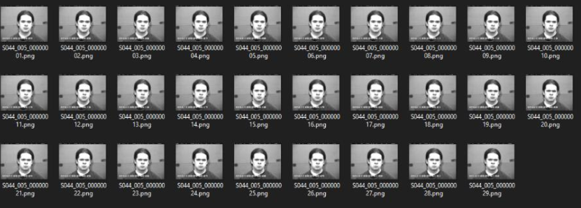
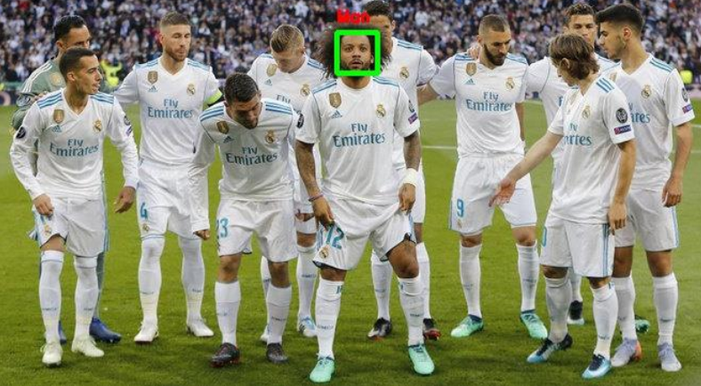
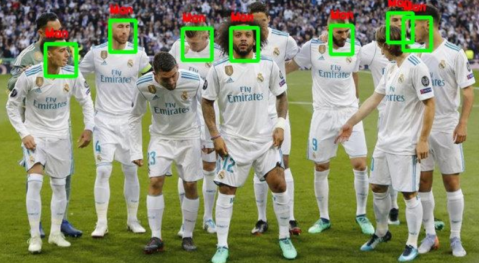
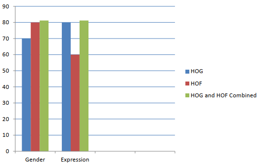
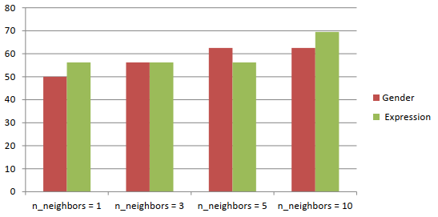
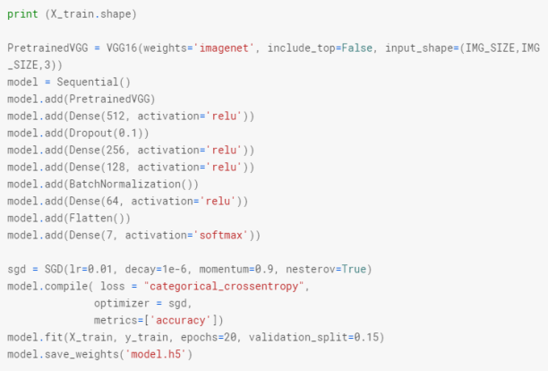
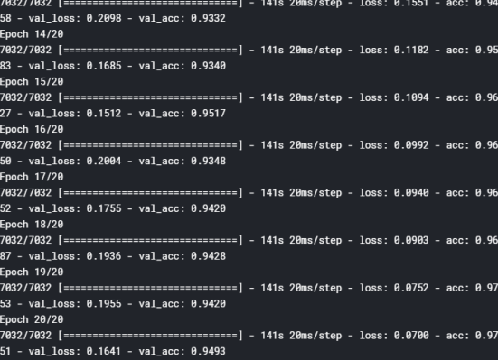
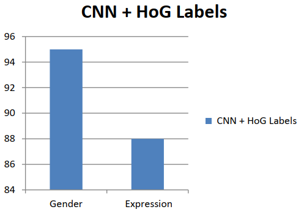
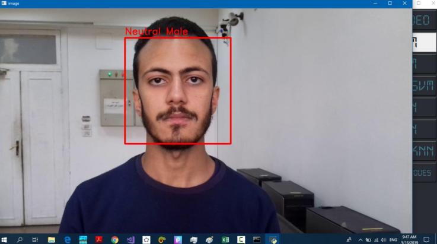

# Gender and facial expression recognition

1- Divide the video into frames:
- In order to work on any video content, we need to break it down to frames of
images that we can work on each one separately:
1) For more accuracy in expression detection: In the training phase we use
cohn-kanade-images Dataset, in which there are many repetition for the
natural faces (Frames). So we skip at least 10% or more of the starting
images.
Here is an example of one sample (Person) performing Sad expression in 29
frames but doesn’t start the real expression till frame number 15:

2- The Next step is to detect the facial area from an input image. We use haar cascade
Algorithm to detect facial region from an input image. Here we will deal with
detection of the face area. OpenCV already contains many pre-trained classifiers for
face, eyes, smiles, etc. Those XML files are stored in the opencv/data/haarcascades/
folder. Let's create a face and eye detector with OpenCV.
- Haar cascade drawbacks:
1) One of it’s disadvantages that it’s Results are tricky to interpret, for it came up with
multiple boxes as detected faces. And later it choose the most likely boxes with high
probability of being a face region, Which lead to the algorithm either to miss some faces in a
picture or detect any object as a face when it’s Not.
2) Longer Training time
3) Less robust to occlusion

# HAAR Cascade Result:

- OUR Trail to solve this problems is using YOLO:
# YOLO Results:

- How YOLO work?
We used pre-trained Model for Cropping Faces, and we use it as one of the
parameters in YOLO architecture: we will add those models in references
section.
- Why it’s Better?
YOLO is far more accurate in detecting the face area when it’s not in fronted
(Straight) shape, while as we mentioned before this is a drawback in Haar
cascade algorithm.
And, while Haar cascade take much time to train, YOLO is faster in training
time. 

3) Feature Extraction & Training Phase:
- For Our first trial: we were interested in detecting the gender (only). SO, we used HOG
Descriptor as a feature extraction, and the feature vectors that comes out the model, we
passed it to SVM classifier, with the following parameters: (Kernel = Linear) and we
didn’t change any other parameter.
- For the second trial we tried to detect both (Gender and Expression) either separately or
make the prediction for them both at the same time: So, We used HOF Descriptor as a
feature extraction method.
Accuracies chart (HOG + HOF WITH SVM):

- for Our second trial (For The classifier): We Passed both HOG and HOF features to KNN
classifier
And we trained different models (With the same Features) but with multiple parameters K
(N_ Neighbors) and that was the final result:

- Comparing the two algorithms, It’s clear that SVM is the winning here and with
fair difference.
But the result could be improved for both gender and expression detection.
And that’s why we try CNN:

# CNN Architecture:
Processing of images
Here, we have followed 5 simple steps for processing and changing our images such that they become suitable for feeding to the model for training.
Step-1: Converting images to gray-scale.
Step-2: Detect face in the image using OpenCV HAAR Cascade.
Step-3: Crop the image to the face.
Step-4: Resize the image to 350*350.
Now the images are perfectly suitable for feeding to the model.
Using pre-trained Model (VGG16) with transfer learning technique:
With Training Data of: 85% of the Dataset, and validation Data of: 15%
Our Final proposed CNN Architecture:

# CNN – Training Accuracy:

CNN Testing Accuracy: Adding the HOG label from first trial, we got a better results for both
Gender and Expression Classification:

# Testing Phase:

# Snapshots From The Run:

1) Mode A: Male

# Conclusions:

# For pre- Processing Phase:
- Resizing the images with the same size for both (Training and Testing phase) has a huge effect in the whole process from detecting the area of interest (The Face),
to test with new video or photo.
- Turning all the images for both (Training and Testing phase) to gray. For our result does not depend on the color of the image. Furthermore, there are many
human images which were inherently black and white in color. So, in order to make all of the images same we decided to convert rest of the images to grayscale so that during training, model should treat all of the images equally
regardless of their color.
# For Training Phase:
- Deep learning algorithms, in our case (CNN) has a better results for detecting images than the regular machine learning algorithms (SVM & KNN)
But, it’s important to mention that the datasets used with CNN was (Images Data) on the other hand, the dataset used to train SVM & KNN Models, which
have been trained on a different dataset (Videos Dataset).

# For Testing Phase:
- We find that a real time detection (Testing) would be a good test measure for the Reliability of the project, so we tested all the trained model with real videos that
we recorded it ourselves.
But after really far thoroughness in this matter. We found that it would give a higher accuracy for both Gender and expression detection, if we used a high
quality camera for recording.
Regarding the (HOF) models. It gives far better result in detecting the
expression if the face (and we speak in this case about the face as an object) Would keep it position stand still as much as we can. For any small changes in
the position of the face in the video could be considered as a change in the
emotion features.

# References

- Datasets used in the project:
1) FERG_DB_orig Dataset [Animated]
2) Cohn-kanade Dataset [Human]
3) Jaffe Dataset [Human]
4) KDEF Dataset [Human]
